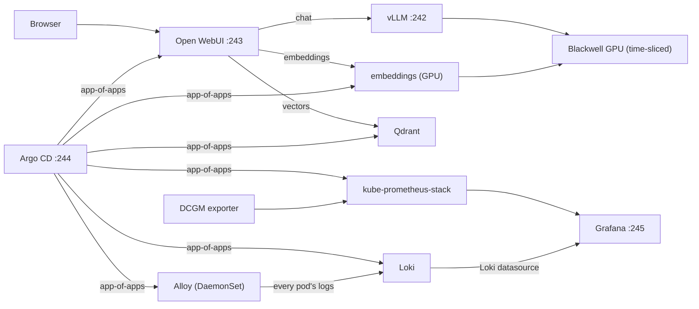

# Atmos-Orchestrated Proxmox k3s HA Cluster

A complete, [Atmos](https://atmos.tools/)-driven workflow that stands up a
**6-node HA [k3s](https://k3s.io/) cluster on Proxmox** using:

| Layer | Tool | What it does |
| --- | --- | --- |
| Infrastructure | **OpenTofu** (`bpg/proxmox`) | Clones 6 Ubuntu 24.04 VMs from a cloud-init template |
| Configuration | **Ansible** | OS prep, HA k3s install, `kube-vip` control-plane VIP |
| Add-ons | **Helmfile** | **Cilium** (CNI, kube-proxy replacement, Gateway API, L2 LB) + **Kyverno** (policy) |
| GPU | **Helmfile** | **NVIDIA GPU Operator** (time-sliced) on a bare-metal Blackwell node + **vLLM** OpenAI-compatible LLM serving |
| GitOps | **Argo CD** | Bootstrapped by Helmfile, then reconciles a **RAG platform** (Open WebUI + Qdrant + GPU embeddings) + **kube-prometheus-stack** from `gitops/` |
| Application | **Helm** | **Filament Tracker** - Next.js + Fastify microservices on Supabase Postgres |
| Orchestration | **Atmos** | Ties all layers together via stacks + workflows |

## Topology

```
                 kube-vip control-plane VIP: 10.10.1.30  (bridged on vmbr0 / 10.10.1.0/24, gw 10.10.1.1)
                 ┌──────────────────────────────────────────────┐
  servers (HA    │  k3s-server-1  10.10.1.31  (--cluster-init)   │
  embedded etcd) │  k3s-server-2  10.10.1.32  (joins via VIP)    │
                 │  k3s-server-3  10.10.1.33  (joins via VIP)    │
                 └──────────────────────────────────────────────┘
  agents         ┌──────────────────────────────────────────────┐
  (workers)      │  k3s-agent-1   10.10.1.34                     │
                 │  k3s-agent-2   10.10.1.35                     │
                 │  k3s-agent-3   10.10.1.36                     │
                 └──────────────────────────────────────────────┘
  GPU (bare      ┌──────────────────────────────────────────────┐
  metal, not a   │  k3s-gpu1      10.10.1.37   (NVIDIA Blackwell)│
  Proxmox VM)    │    taint: nvidia.com/gpu=present:NoSchedule   │
                 └──────────────────────────────────────────────┘
```

- **Pod CIDR** `10.42.0.0/16`, **Service CIDR** `10.43.0.0/16` (k3s defaults; do not overlap with the node `10.10.1.0/24` network).
- k3s flags: `--flannel-backend=none --disable-network-policy --disable-kube-proxy --disable=traefik,servicelb` so Cilium fully owns networking.

## Prerequisites

1. **Tooling on your workstation**
   - [`atmos`](https://atmos.tools/install)
   - [`tofu`](https://opentofu.org/docs/intro/install/) (or set `components.terraform.command: terraform` in `atmos.yaml`)
   - [`ansible`](https://docs.ansible.com/) (`ansible`, `ansible-playbook`)
   - [`helmfile`](https://helmfile.readthedocs.io/) + [`helm`](https://helm.sh/) + the `helm-diff` plugin
   - `kubectl`, `cilium` CLI (optional, for verification)

2. **A Proxmox Ubuntu 24.04 cloud-init template** named `ubuntu-2404-cloudinit`
   (or change `template_name` in the catalog). Create one like:

   ```bash
   # On the Proxmox host
   cd /var/lib/vz/template/iso
   wget https://cloud-images.ubuntu.com/noble/current/noble-server-cloudimg-amd64.img

   qm create 9000 --name ubuntu-2404-cloudinit --memory 2048 --cores 2 \
     --net0 virtio,bridge=vmbr0 --scsihw virtio-scsi-pci
   qm importdisk 9000 noble-server-cloudimg-amd64.img local-lvm
   qm set 9000 --scsi0 local-lvm:vm-9000-disk-0
   qm set 9000 --ide2 local-lvm:cloudinit --boot c --bootdisk scsi0 --serial0 socket --vga serial0
   qm set 9000 --agent enabled=1
   qm template 9000
   ```

3. **Credentials / SSH** — copy `.env.example` to `.env`, fill it in, then:

   ```bash
   set -a; . ./.env; set +a
   ```

## Repository layout

```
atmos.yaml                        # Atmos root config (terraform/ansible/helmfile + stacks + workflows)
components/
  terraform/proxmox-vms/          # bpg/proxmox VM clones
  ansible/k3s/                    # site.yml, inventory, group_vars, roles (common, kube-vip, k3s-server, k3s-agent, gpu)
  helmfile/cilium/                # Cilium CNI (+ Gateway API, L2 LB)
  helmfile/kyverno/               # Kyverno policy engine + starter + filament policies
  helmfile/filament-app/          # Filament Tracker app (local Helm chart)
  helmfile/hubble-ui/             # Exposes Hubble UI on the LAN (local Helm chart)
  helmfile/gpu-operator/          # NVIDIA GPU Operator (device plugin + GFD + DCGM, time-slicing; toolkit off)
  helmfile/vllm/                  # vLLM OpenAI-compatible server (local Helm chart)
  helmfile/argocd/                # Argo CD GitOps engine (bootstrap)
apps/
  filament-tracker/               # app source: services/, web/, chart/
  hubble-ui-gateway/              # Gateway + HTTPRoute for Hubble UI
  vllm/                           # vLLM Helm chart (Deployment + LB Service + Cilium LB pool)
gitops/                           # Argo CD app-of-apps (RAG platform + monitoring + logging)
  root-app.yaml                   # app-of-apps root Application
  apps/                           # child Applications (monitoring, loki, alloy, qdrant, embeddings, open-webui, networking)
  networking/                     # Cilium LB pools for open-webui + grafana
  embeddings/                     # GPU embeddings server (vLLM embed mode) manifests
stacks/
  catalog/cluster.yaml            # single source of truth (nodes, VIP, CIDRs, Proxmox params)
  deploy/prod/cluster.yaml        # prod stack wiring all components
  workflows/cluster.yaml          # deploy-cluster / setup-gpu-os / deploy-gpu / deploy-rag / deploy-app / destroy-cluster
.github/workflows/build-images.yml # build + push the 3 images to GHCR
```

## Deploy

End-to-end with the Atmos workflow:

```bash
atmos workflow deploy-cluster -f cluster
```

Or step by step:

```bash
# 1. Create the VMs
atmos terraform apply proxmox-vms -s prod

# 2. Install HA k3s + kube-vip
atmos ansible playbook k3s -s prod

# 3. Networking + policy
atmos helmfile apply cilium -s prod
atmos helmfile apply kyverno -s prod
```

After Ansible runs, a kubeconfig pointing at the VIP is written to
`components/ansible/k3s/fetched/kubeconfig`. Point `kubectl`/`helmfile` at it:

```bash
export KUBECONFIG=$PWD/components/ansible/k3s/fetched/kubeconfig
kubectl get nodes -o wide
```

## Configuration

All cluster-wide settings live in
[`stacks/catalog/cluster.yaml`](stacks/catalog/cluster.yaml): node names/IPs/VMIDs,
the control-plane VIP, network gateway/bridge, and the pod/service CIDRs. The
`prod` stack ([`stacks/deploy/prod/cluster.yaml`](stacks/deploy/prod/cluster.yaml))
imports it and passes the values down to every component, so there is one place
to edit when adapting this to your environment.

## Secrets

- **Proxmox** endpoint/token → environment variables (see `.env.example`).
- **k3s join token** → encrypted with Ansible Vault in
  [`components/ansible/k3s/group_vars/all/vault.yml`](components/ansible/k3s/group_vars/all/vault.yml).
  Replace the placeholder and re-encrypt:

  ```bash
  ansible-vault encrypt components/ansible/k3s/group_vars/all/vault.yml
  ```

Nothing sensitive is committed; `.gitignore` excludes state, kubeconfig, and `.env`.

## Filament Tracker application

A modern 3D-printing filament inventory tracker that shows off the cluster's
capabilities. Source lives in [`apps/filament-tracker/`](apps/filament-tracker/).

- **Microservices**: `catalog-service` (materials/brands/colors) and
  `inventory-service` (spools + usage log), both Fastify + Drizzle, plus a
  Next.js `web` frontend that talks to them over cluster DNS (BFF pattern).
- **Supabase**: both services connect to a Supabase Cloud Postgres via a
  `DATABASE_URL` secret; they create their own schemas (`catalog`, `inventory`)
  on startup.
- **Cilium**: exposed through the **Gateway API** with a **LoadBalancer IP
  advertised over L2** (no servicelb needed), and locked down with
  **CiliumNetworkPolicies** (default-deny; only `web -> services`,
  `services -> Supabase`, and DNS are allowed). View flows in Hubble UI.
- **Kyverno**: custom `ClusterPolicy`s enforce pinned image tags, resource
  limits, non-root/hardened containers, and standard labels on the `filament`
  namespace (see [`components/helmfile/kyverno/filament-policies`](components/helmfile/kyverno/filament-policies)).

### 1. Build & push images (GHCR)

Push to `main` (or run the workflow manually) to build all three images:

```bash
# Images land at ghcr.io/<owner>/filament-{catalog,inventory,web}:<sha> (+ :latest)
gh workflow run build-images.yml
```

Then set your owner and a pinned tag in the `filament-app` component vars in
[`stacks/catalog/cluster.yaml`](stacks/catalog/cluster.yaml):

```yaml
image_owner: "<your-github-user-or-org>"
image_tag: "sha-<git-sha>"     # or "latest"
image_pull_secret: ""          # set if the packages are private
```

### 2. Create the namespace + Supabase secret

Grab the **connection pooler** URL from your Supabase project
(Project Settings -> Database -> Connection pooling, port 6543):

```bash
export KUBECONFIG=$PWD/components/ansible/k3s/fetched/kubeconfig
kubectl create namespace filament
kubectl -n filament create secret generic filament-db \
  --from-literal=DATABASE_URL='postgresql://postgres.<ref>:<password>@aws-0-<region>.pooler.supabase.com:6543/postgres'
```

If your packages are private, also create the pull secret and set
`image_pull_secret` to its name:

```bash
kubectl -n filament create secret docker-registry ghcr \
  --docker-server=ghcr.io --docker-username=<user> --docker-password=<PAT>
```

### 3. Deploy

The full `deploy-cluster` workflow now includes the app. To deploy or redeploy
just the app onto an existing cluster:

```bash
atmos workflow deploy-app -f cluster
# or directly:
atmos helmfile apply filament-app -s prod -- --skip-diff-on-install
```

### 4. Access

The Gateway is announced at **`http://10.10.1.240`** on the `10.10.1.0/24`
segment. Verify the LB IP was assigned:

```bash
kubectl -n filament get gateway filament
kubectl -n filament get svc            # cilium-gateway-filament -> EXTERNAL-IP 10.10.1.240
```

Local development (outside the cluster):

```bash
# in each services/* dir and web/: set DATABASE_URL / CATALOG_URL / INVENTORY_URL
npm install && npm run dev
```

## Observability (Hubble UI)

Cilium ships [Hubble](https://github.com/cilium/hubble) (relay + UI) enabled
by default in this cluster (`components/helmfile/cilium`), but it's
ClusterIP-only out of the box. The `hubble-ui` component exposes it on the
LAN the same way the app is exposed - a Cilium Gateway API `Gateway` with an
L2-announced LoadBalancer IP, reusing the `CiliumLoadBalancerIPPool` /
`CiliumL2AnnouncementPolicy` already shipped with `filament-app` (they
select any Service Cilium creates for a Gateway, regardless of namespace).

```bash
atmos helmfile apply hubble-ui -s prod -- --skip-diff-on-install
```

Then browse to **`http://10.10.1.241`** to see live network flows, policy
verdicts, and service maps for the whole cluster.

> **No authentication.** Hubble UI has no login of its own - only expose it
> on a trusted LAN segment, never publicly.

## GPU node + vLLM (NVIDIA Blackwell)

A standalone bare-metal machine with an NVIDIA Blackwell GPU
(k3s node name `k3s-gpu1`, `10.10.1.37`) is joined to the cluster as a **tainted** k3s agent
so that **only GPU workloads** (vLLM, Ollama, ...) schedule there. Everything
else is repelled by the `nvidia.com/gpu=present:NoSchedule` taint.

Because it is **not** a Proxmox VM, it is deliberately absent from the Terraform
`nodes:` map and lives only in the Ansible inventory
([`components/ansible/k3s/inventory/hosts.yml`](components/ansible/k3s/inventory/hosts.yml),
group `k3s_gpu`, inventory alias `k3s-gpu-1`). The host var `is_vm: false` skips
the `qemu-guest-agent` step, and `k3s_node_labels` / `k3s_node_taints` are
rendered into the agent's `/etc/rancher/k3s/config.yaml`.

> **Note:** the inventory *alias* is `k3s-gpu-1`, but k3s registers the
> Kubernetes node under the box's actual OS **hostname**, `k3s-gpu1` (no dash).
> Use `k3s-gpu1` in `kubectl` commands - `hostname` on the box is the source of
> truth if it ever drifts again.

### Prerequisites on the GPU box

- Ubuntu (tested on 24.04 and 26.04) with the **NVIDIA driver already
  installed** (Blackwell needs a recent driver, ~570+). Verify with `nvidia-smi`.
- SSH reachable as the `ubuntu` user with your ed25519 key (same as the VMs).
  Passwordless sudo is configured by the bring-up workflow below (or run it once
  with `--ask-become-pass`).

`nvidia-container-toolkit` does **not** need to be pre-installed - the
`setup-gpu-os` workflow installs it.

The **GPU Operator** runs with **both** `driver.enabled=false` (host driver is
used) and `toolkit.enabled=false`. k3s auto-detects the host's
`nvidia-container-runtime` and defines the `nvidia` containerd runtime itself, so
the operator only manages the **device plugin**, **GPU feature discovery**,
**NFD**, and **DCGM metrics**. Enabling the operator toolkit here would create a
second, competing `nvidia` runtime definition and break containerd - see
[Troubleshooting](#troubleshooting).

### Host bring-up (Ansible only)

The VM nodes are provisioned by Terraform and then prepped by Ansible. The
bare-metal GPU box has **no Terraform step**, so the `setup-gpu-os` workflow does
the equivalent OS bring-up with **Ansible alone**, scoped to the `k3s_gpu` group:

- common OS prep (packages, swap off, kernel modules, sysctl),
- passwordless sudo for the `ubuntu` user,
- asserts the NVIDIA driver is present (does **not** install it - it is
  kernel/version-sensitive),
- installs `nvidia-container-toolkit` so k3s auto-detects the `nvidia` runtime,
- joins the node as a tainted k3s agent.

```bash
atmos workflow setup-gpu-os -f cluster
```

This maps to `atmos ansible playbook k3s -s prod -- --limit k3s_gpu` (the
server / kube-vip / kubeconfig-fetch plays are skipped by the limit). The
GPU-host tasks live in the `gpu` role
([`components/ansible/k3s/roles/gpu`](components/ansible/k3s/roles/gpu)) and run
before the agent join so the toolkit is present when k3s first starts.

On a brand-new host that does not have passwordless sudo yet, run it once with
`--ask-become-pass` so Ansible can escalate (idempotent afterwards):

```bash
atmos ansible playbook k3s -s prod -- --limit k3s_gpu --ask-become-pass
```

### Deploy

```bash
atmos workflow deploy-gpu -f cluster
```

This runs the (idempotent) k3s playbook to prep/join/label/taint the node,
installs the GPU Operator, then deploys vLLM. Or step by step (use
`setup-gpu-os` to scope the Ansible run to just the GPU host):

```bash
atmos workflow setup-gpu-os -f cluster                              # prep + join the GPU node (Ansible only)
atmos helmfile apply gpu-operator -s prod -- --skip-diff-on-install  # device plugin + GFD + NFD + DCGM
atmos helmfile apply vllm -s prod -- --skip-diff-on-install          # LLM server
```

### Verify

```bash
export KUBECONFIG=$PWD/components/ansible/k3s/fetched/kubeconfig

# Node joined, tainted, and advertising a GPU
kubectl get nodes -o wide | grep gpu
kubectl describe node k3s-gpu1 | grep -A2 -e Taints -e nvidia.com/gpu

# GPU Operator operands healthy
kubectl -n gpu-operator get pods

# Optional smoke test: a CUDA job that must tolerate the taint + request a GPU
kubectl run cuda-check --rm -it --restart=Never \
  --image=nvcr.io/nvidia/k8s/cuda-sample:vectoradd-cuda12.5.0 \
  --overrides='{"spec":{"runtimeClassName":"nvidia","tolerations":[{"key":"nvidia.com/gpu","operator":"Exists","effect":"NoSchedule"}],"containers":[{"name":"cuda-check","image":"nvcr.io/nvidia/k8s/cuda-sample:vectoradd-cuda12.5.0","resources":{"limits":{"nvidia.com/gpu":1}}}]}}'
```

### Test vLLM (OpenAI-compatible API)

vLLM is served on a dedicated Cilium L2 LoadBalancer at **`http://10.10.1.242:8000`**.
The first start pulls + loads the model (`Qwen/Qwen2.5-3B-Instruct` by default),
which can take a few minutes - watch `kubectl -n vllm logs deploy/vllm -f`.

```bash
# List the served model
curl http://10.10.1.242:8000/v1/models

# Chat completion
curl http://10.10.1.242:8000/v1/chat/completions \
  -H 'Content-Type: application/json' \
  -d '{
    "model": "Qwen/Qwen2.5-3B-Instruct",
    "messages": [{"role": "user", "content": "Explain k3s in one sentence."}]
  }'
```

Tune the model, image tag, VRAM utilization and LB IP in the `vllm` component
vars in [`stacks/catalog/cluster.yaml`](stacks/catalog/cluster.yaml). For a
smaller card drop `vllm_model` to `Qwen/Qwen2.5-1.5B-Instruct`. For gated models,
create a Secret with an `HF_TOKEN` key in the `vllm` namespace and set
`vllm_hf_token_secret` to its name.

## RAG platform (GitOps: Argo CD + Open WebUI)

A document-aware chat platform running entirely on the cluster, managed with
**GitOps**: Helmfile bootstraps **Argo CD**, which then reconciles the RAG
workloads and monitoring from the [`gitops/`](gitops/) directory. This layer
also demonstrates **GPU sharing** - the single Blackwell GPU is time-sliced so
the chat model and the embeddings model run on it simultaneously.

Components:

| Service | LB IP | Role |
| --- | --- | --- |
| Open WebUI | `10.10.1.243` | Chat UI + RAG document upload |
| Argo CD | `10.10.1.244` | GitOps engine / sync dashboard |
| Grafana | `10.10.1.245` | GPU + cluster dashboards (NVIDIA DCGM), logs (Loki) |
| vLLM (chat) | `10.10.1.242` | OpenAI-compatible chat completions |
| Qdrant | in-cluster | Vector database (embeddings store) |
| embeddings | in-cluster | vLLM embed-mode (`BAAI/bge-base-en-v1.5`) |
| Loki | in-cluster | Log storage + query engine (filesystem-backed) |
| Grafana Alloy | in-cluster (DaemonSet) | Ships every pod's logs to Loki |



### GPU time-slicing

So both the chat LLM and the embeddings model fit on one GPU, the GPU Operator
advertises the card as several logical `nvidia.com/gpu` devices
(`gpu_timeslicing_replicas`, default 4 in
[stacks/catalog/cluster.yaml](stacks/catalog/cluster.yaml)). Time-slicing
**shares** VRAM (it does not partition it), so vLLM's
`vllm_gpu_memory_utilization` is lowered to `0.55` to leave room for the
embeddings model. Budget these two values to your card's VRAM.

### Prerequisite: Argo CD repo access

Argo CD pulls the `gitops/` manifests from this Git repo. If your fork is
**private**, register a read-only credential before syncing (or make the repo
public). Update `repoURL` in the `gitops/*.yaml` files if you forked.

```bash
export KUBECONFIG=$PWD/components/ansible/k3s/fetched/kubeconfig
# Option A: HTTPS + a GitHub PAT (read-only)
kubectl -n argocd create secret generic repo-atmos-proxmox-k8s \
  --from-literal=type=git \
  --from-literal=url=https://github.com/rykelley/atmos-proxmox-k8s.git \
  --from-literal=username=<github-user> \
  --from-literal=password=<github-PAT>
kubectl -n argocd label secret repo-atmos-proxmox-k8s argocd.argoproj.io/secret-type=repository
# Option B: make the GitHub repo public (no secret needed)
```

### Deploy

```bash
atmos workflow deploy-rag -f cluster
```

This enables GPU time-slicing, re-applies vLLM, bootstraps Argo CD, and applies
[gitops/root-app.yaml](gitops/root-app.yaml). Argo CD then syncs everything
under [gitops/apps/](gitops/apps/). Or step by step:

```bash
atmos helmfile apply gpu-operator -s prod -- --skip-diff-on-install  # time-slicing
atmos helmfile apply vllm -s prod -- --skip-diff-on-install          # lowered VRAM
atmos helmfile apply argocd -s prod -- --skip-diff-on-install        # GitOps engine
KUBECONFIG=$PWD/components/ansible/k3s/fetched/kubeconfig \
  kubectl apply -f gitops/root-app.yaml                              # hand off to Argo CD
```

### Verify

```bash
export KUBECONFIG=$PWD/components/ansible/k3s/fetched/kubeconfig

# GPU now advertises multiple logical devices
kubectl describe node k3s-gpu1 | grep -A8 Allocatable | grep nvidia.com/gpu   # -> 4

# Argo CD login (initial admin password)
kubectl -n argocd get secret argocd-initial-admin-secret \
  -o jsonpath='{.data.password}' | base64 -d; echo
# then browse http://10.10.1.244  (user: admin)

# All Applications Synced/Healthy
kubectl -n argocd get applications

# Chat + embeddings pods co-scheduled on the GPU node
kubectl -n vllm get pods -o wide
kubectl -n rag get pods -o wide
```

### Use it

1. Browse to **`http://10.10.1.243`** and create the first Open WebUI account
   (it becomes the admin).
2. The vLLM chat model appears in the model picker automatically.
3. Upload a document (click `+` / Documents), then ask a question about it -
   Open WebUI embeds the doc via the GPU embeddings server, stores vectors in
   Qdrant, retrieves the relevant chunks, and grounds vLLM's answer on them.
4. Watch **`http://10.10.1.245`** (Grafana -> NVIDIA DCGM dashboard) - GPU
   utilization and memory spike during inference.

### Logs (Loki + Grafana Alloy)

Every pod's logs across the whole cluster - not just the RAG namespace - are
shipped to **Loki** by **Grafana Alloy**
([gitops/apps/alloy.yaml](gitops/apps/alloy.yaml),
[gitops/apps/loki.yaml](gitops/apps/loki.yaml)) and queryable from Grafana
alongside metrics, so you don't need `kubectl logs` to debug what happened:

1. Open **`http://10.10.1.245`** -> **Explore** -> pick the **Loki**
   datasource.
2. Query with [LogQL](https://grafana.com/docs/loki/latest/query/), e.g.:

   ```logql
   {namespace="vllm"}
   {namespace="rag", pod=~"embeddings.*"} |= "error"
   {namespace="gpu-operator"} | logfmt
   ```

3. Or from the CLI, the same log store answers via `logcli` /
   `curl http://loki-gateway.monitoring.svc.cluster.local/loki/api/v1/query_range`
   from inside the cluster.

Alloy runs as a DaemonSet and discovers pods via the Kubernetes API
(`discovery.kubernetes` + `loki.source.kubernetes` - no privileged hostPath
mount needed). Loki runs in `SingleBinary` mode with a 10Gi filesystem-backed
PVC and a 7-day retention (`loki.limits_config.retention_period`) - sized for
learning/homelab volume, not production log scale.

### GitOps loop

Change a workload by editing its file under [gitops/apps/](gitops/apps/) (e.g.
bump a chart version or tweak Open WebUI env), commit, and push to `main`. Argo
CD detects the change and syncs it - no `helmfile`/`kubectl` needed. This is the
core GitOps workflow this layer is meant to teach.

## Troubleshooting

- **`GatewayClass`/`Gateway` stuck `Unknown`/`Pending`, or no LB IP gets
  announced (empty `l2-announce` state, no `cilium-l2announce-*` lease):**
  this happens if the Cilium agents/operator were already running *before*
  Gateway API CRDs existed or before `enable_gateway_api` /
  `enable_l2_announcements` were turned on - the controllers only wire these
  features up at startup. Fix by restarting the affected components after
  the config/CRDs are in place:

  ```bash
  kubectl -n kube-system rollout restart deploy/cilium-operator
  kubectl -n kube-system rollout restart ds/cilium
  ```

- **Cilium operator logs `Required GatewayAPI resources are not found ...
  "tlsroutes.gateway.networking.k8s.io" not found`:** Cilium's Gateway
  controller requires the *experimental* Gateway API CRD channel (adds
  `TLSRoute`/`TCPRoute`/`UDPRoute`), not the `standard-install.yaml` used by
  most other implementations. This repo already points
  `gateway_api_crds_url` at `experimental-install.yaml` - if you changed it,
  switch it back and re-apply.

- **vLLM pod stuck `Pending` or GPU not allocatable
  (`kubectl describe node k3s-gpu1` shows no `nvidia.com/gpu`):** the GPU
  Operator must finish first. Check `kubectl -n gpu-operator get pods` - the
  `nvidia-device-plugin-*` DaemonSet must be Running on `k3s-gpu1`. If the
  device plugin crashes, confirm the host driver works with `nvidia-smi` on the
  box and that `nvidia-container-toolkit` is installed (the `setup-gpu-os`
  workflow handles the latter).

- **GPU node `NotReady`, or every GPU pod fails `CreateContainerError:
  "no runtime for \"nvidia\" is configured"`:** something defined a broken /
  duplicate `nvidia` containerd runtime. On k3s this is almost always caused by
  **enabling the GPU Operator's toolkit**: k3s already auto-detects the host's
  `nvidia-container-runtime` and defines the `nvidia` runtime, so the operator
  toolkit adds a *second*, competing definition and containerd refuses to load
  the config (node goes `NotReady`). This repo ships `toolkit.enabled=false` for
  exactly this reason. To recover, check the node's config for a single `nvidia`
  runtime block and remove any custom templates that duplicate it:

  ```bash
  # on the GPU host
  sudo grep -c "runtimes.'\?nvidia'\?\]" /var/lib/rancher/k3s/agent/etc/containerd/config.toml  # want 1
  sudo rm -f /var/lib/rancher/k3s/agent/etc/containerd/config*.toml.tmpl   # drop custom overrides
  sudo systemctl restart k3s-agent
  ```

- **vLLM `CrashLoopBackOff` with a CUDA / "no kernel image" error:** the
  `vllm_image_tag` is too old for Blackwell (sm_120). Pin a release built
  against CUDA 12.8+ (e.g. `v0.11.0` or newer) in the `vllm` component vars.

- **Argo CD Applications stuck `ComparisonError` / `repository not found`:**
  the `gitops/` repo isn't reachable. Add repo credentials (see "Argo CD repo
  access" above) or make the repo public, and confirm `repoURL` in
  [gitops/root-app.yaml](gitops/root-app.yaml) matches your fork.

- **vLLM or embeddings pod `Pending` after time-slicing, or CUDA OOM in logs:**
  both models share one GPU's VRAM. Lower `vllm_gpu_memory_utilization` further,
  drop `vllm_model` to `Qwen2.5-1.5B-Instruct`, and/or reduce the embeddings
  `--gpu-memory-utilization` in [gitops/embeddings/deployment.yaml](gitops/embeddings/deployment.yaml).
  Confirm the GPU advertises `nvidia.com/gpu: 4` (time-slicing took effect).

- **Open WebUI RAG returns "no relevant context" / embedding errors:** check the
  embeddings pod is Ready and that `RAG_EMBEDDING_MODEL` in
  [gitops/apps/open-webui.yaml](gitops/apps/open-webui.yaml) matches the model
  the embeddings server lists at `/v1/models`.

## Teardown

```bash
atmos workflow destroy-cluster -f cluster
```
